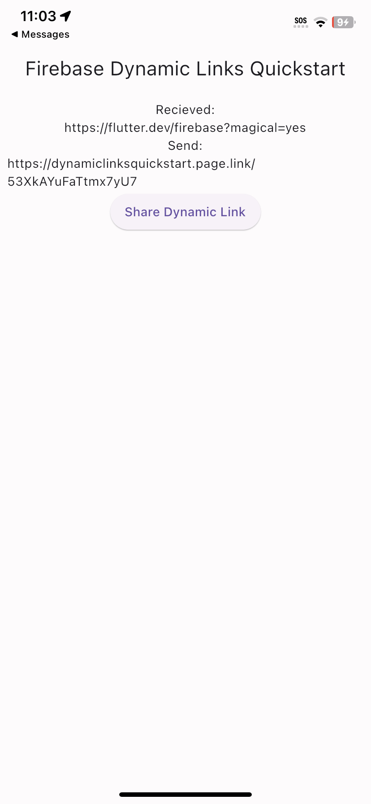

Firebase Dynamic Links Quickstart
==============================

Introduction
------------

- [Read more about Firebase Dynamic Links](https://firebase.google.com/docs/dynamic-links)

Getting Started
---------------

- [Add Firebase to your Flutter Project](https://firebase.google.com/docs/flutter/setup).
- Configure the sample:
  - Run `flutterfire configure` to configure your Firebase project to work with your flutter project.
- Run the sample on your Android device or emulator, or run the app on an iOS device using the `flutter run --release` command.
- Using the sample:
  - When the application is started, a deep link will be generated using your app code.
  - Click **Share**
    to share this deep link to another application.
  - Then in another application, click on the rendered link.
  - The application checks if it was launched from a deep link. If so, the link data will be displayed under the **Receive** heading.
  - Try sharing the deep link from the application and use that deep link to re-launch the application.

Result
-----------

Support
-------

- [Stack Overflow](https://stackoverflow.com/questions/tagged/firebase-dynamic-links)
- [Firebase Support](https://firebase.google.com/support/)

License
-------

Copyright 2023 Google, Inc.

Licensed to the Apache Software Foundation (ASF) under one or more contributor
license agreements.  See the NOTICE file distributed with this work for
additional information regarding copyright ownership.  The ASF licenses this
file to you under the Apache License, Version 2.0 (the "License"); you may not
use this file except in compliance with the License.  You may obtain a copy of
the License at

  http://www.apache.org/licenses/LICENSE-2.0

Unless required by applicable law or agreed to in writing, software
distributed under the License is distributed on an "AS IS" BASIS, WITHOUT
WARRANTIES OR CONDITIONS OF ANY KIND, either express or implied.  See the
License for the specific language governing permissions and limitations under
the License.
