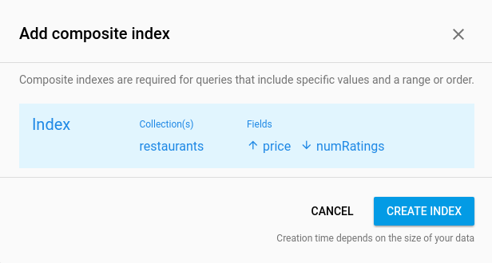

# Firestore Quickstart

## Introduction

Friendly Eats is a restaurant recommendation app built on Firestore.
For more information about Firestore visit [the docs][https://firebase.
google.com/docs].

## Getting Started

* [Set up your Flutter app for Firestore](https://firebase.google.com/docs/flutter/setup)
* In the Authentication tab of the Firebase console go to the
  [Sign-in Method](https://console.firebase.google.com/project/_/authentication/users) page and enable 
  the 'Anonymous sign in provider'.
* Create a Firestore database in the console. 
* For Firestore information for Flutter, visit [setting up your flutter development environment](https://firebase.google.com/docs/firestore/quickstart#dart)
  

### Security Rules

Add the following security rules to your project in the:
[rules tab](https://console.firebase.google.com/project/_/database/firestore/rules):

```
rules_version = '2';
service cloud.firestore {
  match /databases/{database}/documents {
    match /{document=**} {
      allow read, write: if false;
    }

    match /restaurants/{document=**} {
      allow read, write: if request.auth != null;
    }

    match /restaurants/{restaurantid}/ratings/{document=**} {
      allow read, write: if request.auth != null;
    }
  }
}
```

### Run the App

* In the [Podfile](/ios/Podfile), uncomment line 2 and change the platform 
  version to '10.0'
* When you first open the app it will be empty, choose
  **Add Some** from the overflow menu to add some
  new entries.

### Run the App Web

Don't forget to run `flutterfire configure` to set up your app's FirebaseOptions

In order to display images without a CORS exception, use the --web-renderer html flag:
`flutter run -d chrome --web-renderer html`

### Result


### Indexes

As you use the app's filter functionality you may see warnings
in logcat that look like this:

```
com.google.firebase.example.fireeats W/Firestore Adapter: onEvent:error
com.google.firebase.firestore.FirebaseFirestoreException: FAILED_PRECONDITION: The query requires an index. You can create it here: https://console.firebase.google.com/project/...
```

This is because indexes are required for most compound queries in
Firestore. Clicking on the link from the error message will
automatically open the index creation UI in the Firebase console
with the correct paramters filled in:


